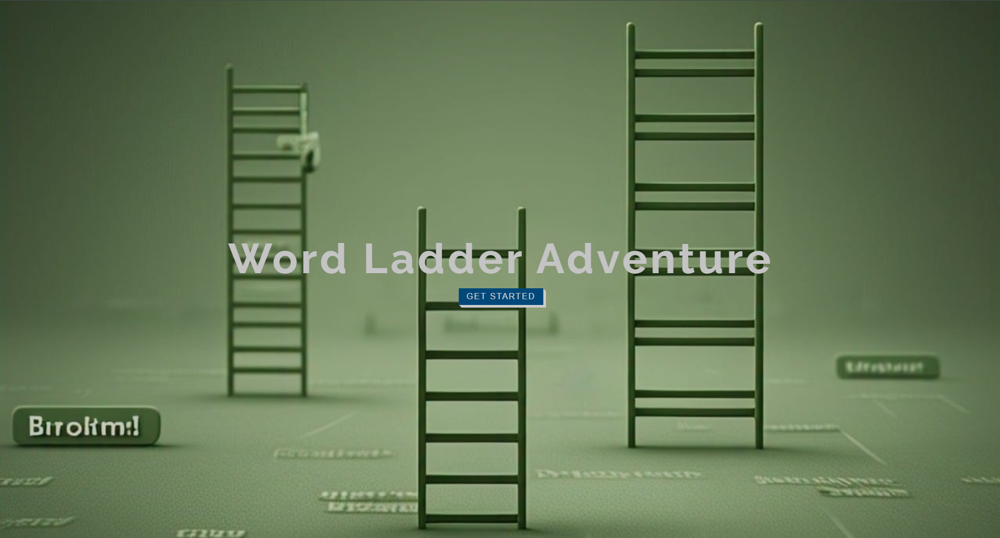
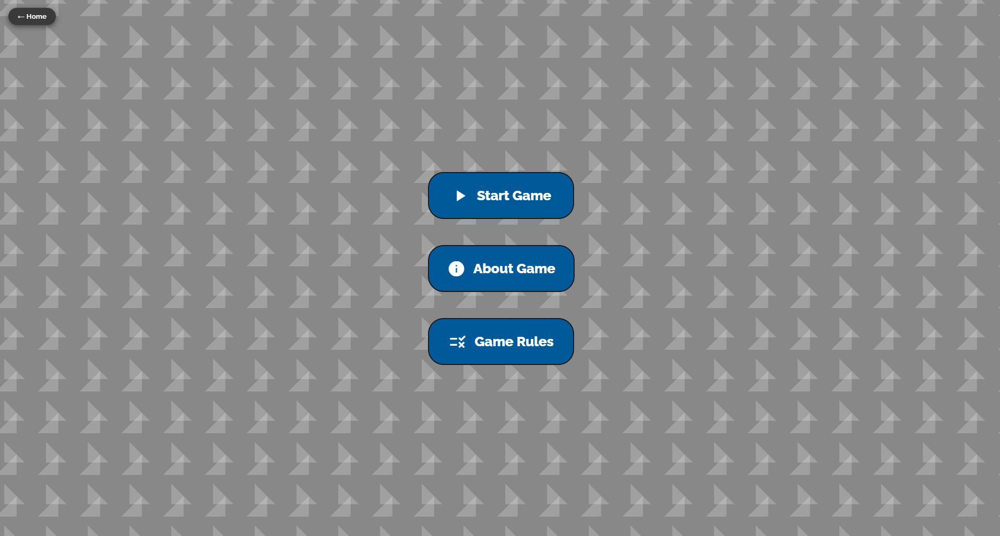
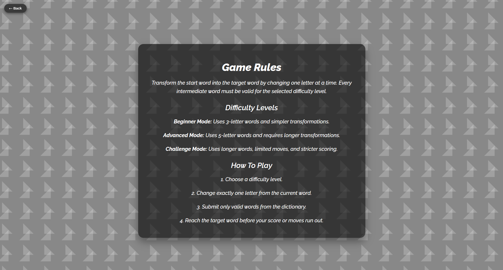
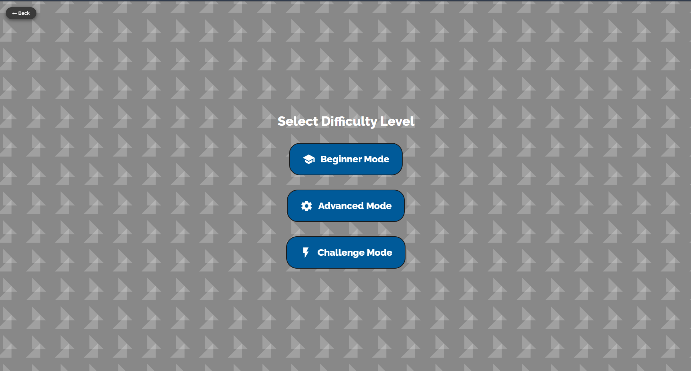
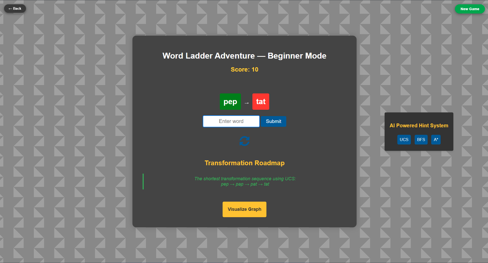
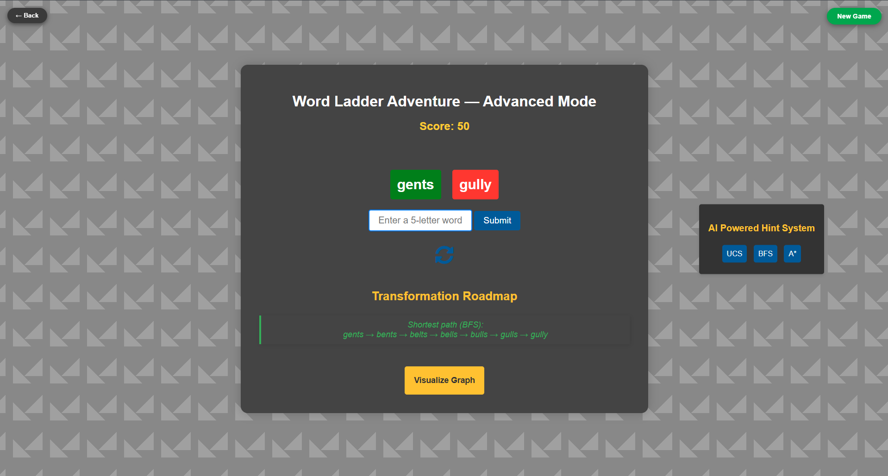
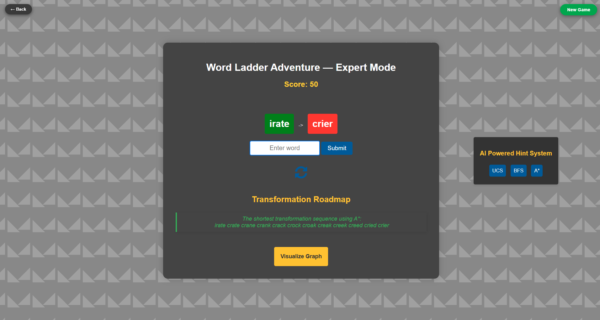
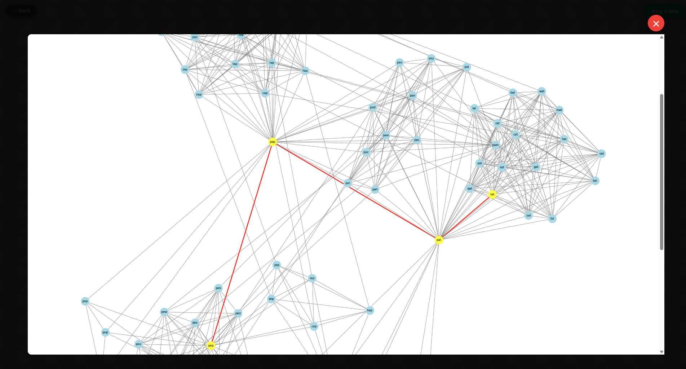
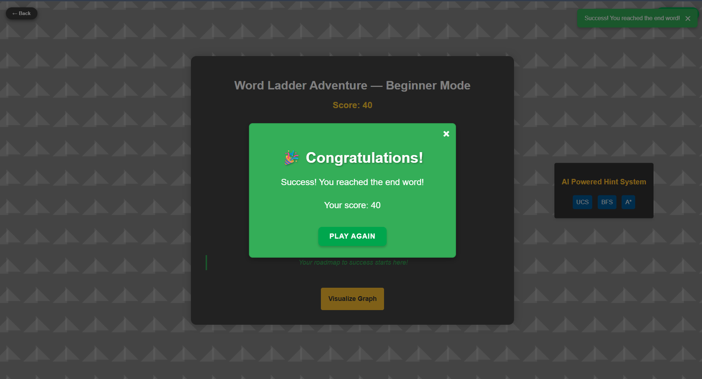
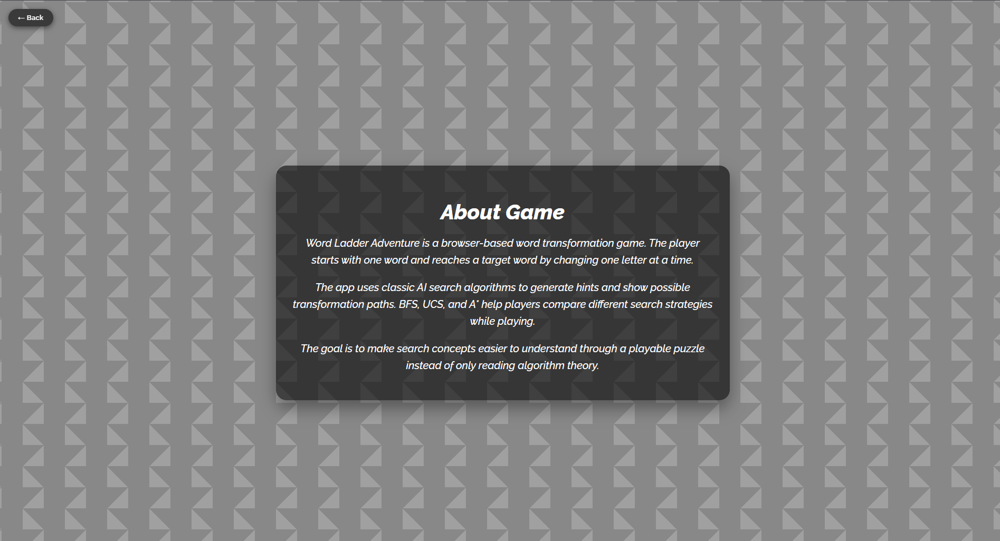

# Word Ladder AI Search Game

A Flask word ladder game that challenges players to transform one word into another by changing one letter at a time. The app uses classic AI search algorithms to generate hints and visualize possible transformation paths.

## Live App

https://word-ladder-ai-search-game.onrender.com

## Features

- Play a word ladder game through a browser interface.
- Choose beginner, advanced, or expert difficulty modes.
- Validate moves against local word dictionaries.
- Score moves based on valid transformations.
- Generate AI hints with BFS, UCS, or A* search.
- Visualize transformation paths with NetworkX and Matplotlib.
- Refresh word pairs and start new games.
- Use separate word lists for 3-letter, 5-letter, and 6-letter modes.

## How The Game Works

Players are given a start word and a target word. Each move must:

- change exactly one letter
- keep the word length the same
- produce a valid dictionary word

The goal is to reach the target word while keeping the score alive.

## Search Algorithms

| Algorithm | Purpose |
| --- | --- |
| BFS | Finds a shortest path by exploring word transformations level by level |
| UCS | Finds a lowest-cost path where each move has equal cost |
| A* | Uses letter differences as a heuristic to guide the search |

## Tech Stack

| Part | Tech |
| --- | --- |
| Language | Python |
| Web framework | Flask |
| Templates | Jinja2 |
| Graphs | NetworkX, Matplotlib |
| Frontend | HTML, CSS, JavaScript |
| Deployment | Render |


## Screenshots

### Home



### Game Page



### Game Rules



### Difficulty Selection



### Beginner Mode



### Advanced Mode



### Challenge Mode



### Graph Visualization



### Game Won



### About Game



## Project Structure

```text
.
|-- app/
|   |-- routes.py              # Game routes, validation, search, and graph generation
|   |-- 3.txt                  # Beginner word list
|   |-- 5.txt                  # Advanced word list
|   |-- 6.txt                  # Expert word list
|   |-- templates/             # Game pages
|   `-- static/                # CSS and images
|-- run.py                     # Flask entrypoint
|-- requirements.txt           # Python dependencies
|-- render.yaml                # Render deployment config
`-- README.md
```

## Install Dependencies

Create and activate a virtual environment:

```bash
python -m venv venv
```

Windows:

```bash
venv\Scripts\activate
```

macOS/Linux:

```bash
source venv/bin/activate
```

Install dependencies:

```bash
pip install -r requirements.txt
```

## Run Locally

```bash
python run.py
```

Open:

```text
http://127.0.0.1:5000
```

## Deployment

The repo includes `render.yaml` for Render.

```text
Build command: pip install -r requirements.txt
Start command: gunicorn run:app
```
